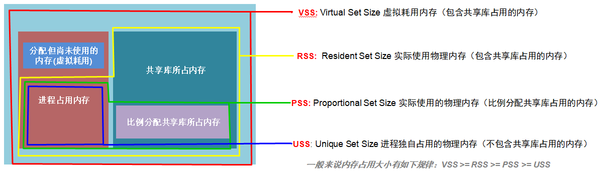

## A process' memory usage from /proc/pid/smaps ##

来源：https://unix.stackexchange.com/questions/33381/getting-information-about-a-process-memory-usage-from-proc-pid-smaps


### 1. Answer ###

Clean pages are pages that have not been modified since they were mapped (typically, text sections from shared libraries are only read from disk (when necessary), never modified, so they'll be in shared, clean pages).
Dirty pages are pages that are not clean (i.e. have been modified).

Private pages are available only to that process, shared pages are mapped by other processes*.

RSS is the total number of pages, shared or not, currently mapped into the process. So `Shared_Clean` + `Shared_Dirty` would be the shared part of the RSS (i.e. the part of RSS that is also mapped into other processes), and `Private_Clean` + `Private_Dirty` the private part of RSS (i.e. only mapped in this process).

PSS (proportional share size) is as you describe. Private pages are summed up as is, and each shared mapping's size is divided by the number of processes that share it.
So if a process had 100k private pages, 500k pages shared with one other process, and 500k shared with four other processes, the PSS would be:

```
100k + (500k / 2) + (500k / 5) = 450k
```


Further readings:

- [ELC: How much memory are applications really using?](https://lwn.net/Articles/230975/)
- [Documentation/filesystems/proc.txt](https://www.kernel.org/doc/Documentation/filesystems/proc.txt) in the kernel source
- [man proc(5)](http://man7.org/linux/man-pages/man5/proc.5.html)
- [Linux Memory Management Overview](http://tldp.org/LDP/khg/HyperNews/get/memory/linuxmm.html)
- [Memory Management](http://tldp.org/LDP/tlk/mm/memory.html) at TLDP.org
- [LinuxMM](https://linux-mm.org/)
  
Regarding process-wide sums:

- RSS can be (approximately+) obtained by summing the Rss: entries in smaps (you don't need to add up the shared/private shared/dirty entries).

```
awk '/Rss:/{ sum += $2 } END { print sum }' /proc/$$/smaps
```

- You can sum up Pss: values the same way, to get process-global PSS.

- USS isn't reported in smaps, but indeed, it is the sum of private mappings, so you can obtain it the same way too


### 2, About VSS，RSS，PSS，USS ###




### 3, others ###
1. [Why read-only memory mapped regions have dirty pages?](https://unix.stackexchange.com/questions/402169/why-read-only-memory-mapped-regions-have-dirty-pages/402173)

    `A dirty page does not necessarily require a write-back.` A dirty page is one that was written to since the kernel last marked it as clean. The data doesn't always need to be saved back into the original file.

    The pages are private, not shared, so they wouldn't be saved back into the original file. It would be impossible to have a dirty page backed by a read-only file. If the page needs to be removed from RAM, it will be saved in swap.

    Pages that are read-only, private and dirty, but within the range of a memory-mapped file, are typically data pages that contain constants that need to be initialized at run time, but don't change after they have been initialized. For example, they may contain static data that embeds pointers; the pointer values depend on the address at which the program or library is mapped, so it has to be computed after the program has started, with the page being read-write at this stage. After the pointers have been computed, the contents of the page won't ever change in this instance of the program, so the page can be changed to read-only. See [“Hunting Down Dirty Memory Pages” by stosb](https://stosb.com/blog/hunting-down-dirty-memory-pages/) for an example with code fragments.

    You may, more rarely, see read-only, executable, private, dirty pages; these happen with some linkers that mix code and data more freely, or with just-in-time compilation.
